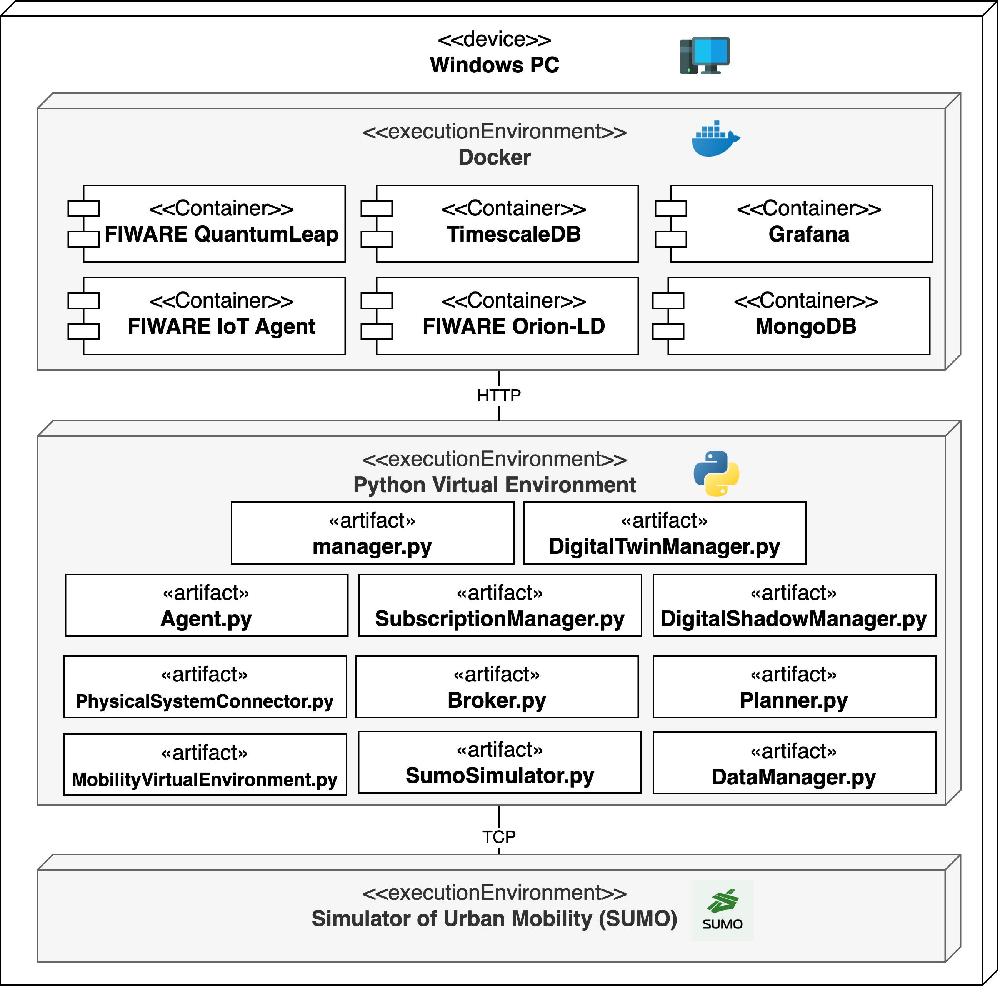

# BoMoDT: Bologna Mobility Digital Twin

BoMoDT is the *Mobility Digital Twin* (MoDT) prototype designed for the Italian City of *Bologna* (Bo). Developed 
following a *Model-Driven Architecture* (MDA) approach and using automatized model-to-model transformations 
[**MoDT-M2M-MTT**](https://anonymous.4open.science/r/MoDT-M2M-TT/README.md) tool, BoMoDT is based on *open-source data* retrieved from the Municipality of Bologna and *open-source technologies*, i.e., **FIWARE** for data management and data interoperability and **Eclipse Simulator of Urban MObility** (SUMO) for traffic conditions modeling and simulations.

## BoMoDT Deployment

### Device Compatibility
The BoMoDT platform is deployed and tested on a Windows device. Its compatibility with Linux and macOS devices 
depends on the underlying technologies supporting the platform. While FIWARE is fully containerized and can 
potentially be adapted to other environments, compatibility with SUMO should be verified by consulting the [*Eclipse Documentation*](https://sumo.dlr.de/docs/Installing/index.html).

  
  
<b>Figure 1:</b> BoMoDT UML Deployment Diagram. 

### How to run BoMoDT
