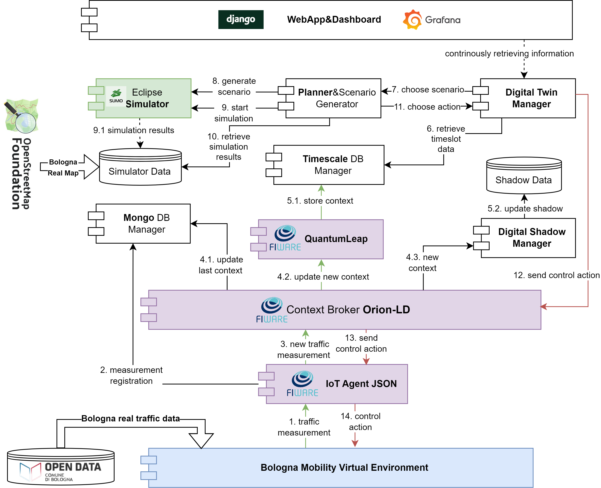
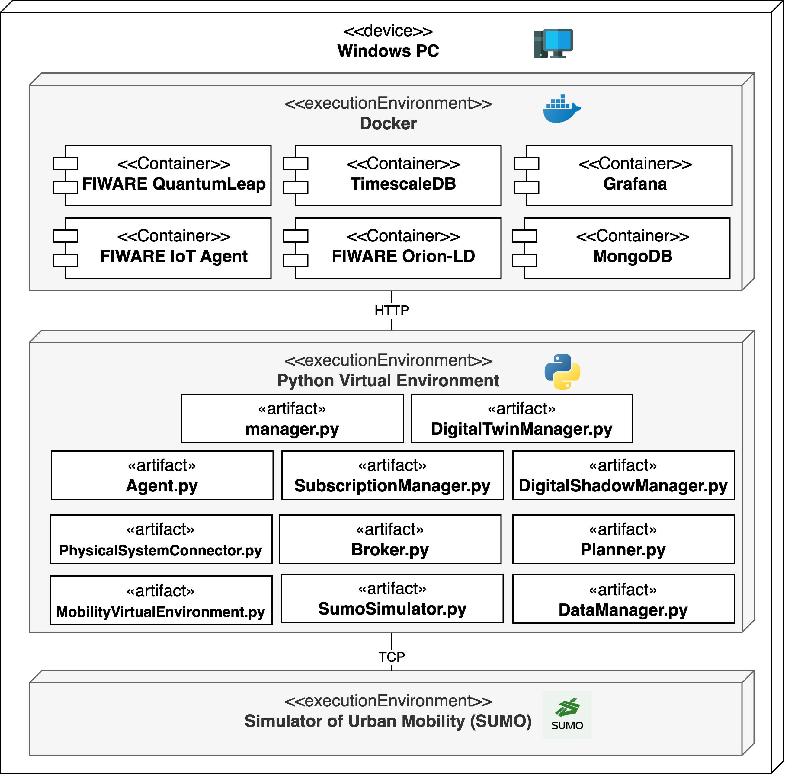

# BoMoDT: Bologna Mobility Digital Twin


BoMoDT is the *Mobility Digital Twin* (MoDT) platform designed for the Italian City of *Bologna* (Bo). Developed 
following a *Model-Driven Architecture* (MDA) approach and using automatized model-to-model transformations [**MoDT-M2M-MTT**](https://anonymous.4open.science/r/MoDT-M2M-TT/README.md) tool, BoMoDT is based on *open-source data* retrieved from the Municipality of Bologna and *open-source technologies*, i.e., **FIWARE** for data management and data interoperability and **Eclipse Simulator of Urban MObility** (SUMO) for traffic conditions modeling and simulations.

The BoMoDT platform provides:

1. Digital **representation** and state **simulation** to model the structural and behavioral aspects of Bologna's infrastructure and simulate traffic scenarios.  
   - [*Eclipse SUMO*](https://eclipse.dev/sumo/) is utilized for traffic modeling and simulation.

2. **Bidirectional synchronization** to enable data flow from physical sensors to the Digital Twin and feedback from the Digital Twin to physical traffic light systems.  
   - [*FIWARE Generic Enablers*](https://www.fiware.org/catalogue/) (GEs) facilitate data exchange and management between the real system and its Digital Twin, ensuring semantic data interoperability.

3. **Traffic monitoring** to observe current traffic flow and stay updated on the state of Bologna City as well as simulation results based on dynamically generated scenarios.  
   - A [*Django WebApp*](https://www.djangoproject.com/), combined with a [*Grafana*](https://grafana.com/) dashboard, is implemented to:  
     *(i)* monitor the state of context entities modeled with FIWARE Smart Data Models,  
     *(ii)* track traffic flow patterns using the Grafana Dashboard, and  
     *(iii)* visualize simulation results after the simulation is completed.

     
## BoMoDT Architecture Overview 
The architecture of the BoMoDT platform is depicted in Figure 1. This diagram offers a simplified overview of the platform's design to facilitate better understanding. Detailed information about each component can be found in their respective folders.
The BoMoDT platform incorporates *open-source data* from the following sources:
* [**Bologna Open Data**](https://opendata.comune.bologna.it/):  Real traffic data from Bologna are collected. For more information, refer to the [*data README*](https://github.com/alessandrasomma28/MOBIDT/blob/main/data/README.md)
* [**OpenStreetMap**](https://www.openstreetmap.org/): The platform retrieves Bologna's road network layout and 
  additional infrastructure details, such as induction loops and traffic lights. For more information, refer to the 
  [*OSM README*](https://github.com/alessandrasomma28/MOBIDT/blob/main/sumoenv/README.md)

<div align="center">
  
  <p><b>Figure 1:</b> BoMoDT Architecture. </p>
</div>

The modules involved in BoMoDT are as follows:

1. **Bologna Mobility Virtual Environment (MVENV)**: This module was introduced because direct access to Bologna's 
   real infrastructure is not feasible. As a result, BoMoDT incorporates an emulator of Bologna's traffic data streams 
   capable of executing control commands for adaptive traffic light management.  As a result, BoMoDT incorporates an 
   emulator to ensure the presence of a continuously running physical counterpart in a Digital Twin context. Further details at [*BOLOGNA MVENV README*](https://github.com/alessandrasomma28/MOBIDT/tree/main/mobilityvenv)

2. **FIWARE** [**Orion-LD Context Broker**](https://github.com/FIWARE/context.Orion-LD): This is the mandatory 
   component in any "powered by FIWARE" smart solution. It is responsible for managing context entities in compliance 
   with the *Next Generation Service Interface* (NGSI) protocol in Linked Data (LD) version. The current context 
   entities' state is stored in a **Mongo** database. Further details at [*FIWARE VENV README*](https://github.com/alessandrasomma28/MOBIDT/blob/main/fiwareenv/README.md)

3. **FIWARE** [**IoT Agent - JSON**](https://github.com/telefonicaid/iotagent-json): This is the Internet of Things 
Agent (IOTA) for JSON-based protocols (with AMQP, HTTP, and MQTT transports). This IoT Agent acts as a bridge between 
JSON and the NGSI interface of the context broker, converting device-specific protocols into the NGSI standard. 
Devices sending measurements or receiving commands must be registered beforehand. Further details at [*FIWARE VENV 
README*](https://github.com/alessandrasomma28/MOBIDT/blob/main/fiwareenv/README.md)

4. **FIWARE** [**QuantumLeap**](https://quantumleap.readthedocs.io/en/latest/): This is a time-based 
   data-persistence Generic Enabler subscribed to context updates, for storing and querying time-series data in 
   **Timescale**. QuantumLeap addresses the inherent limitation of the Context Broker, which only stores the current 
   state. Further details at [*FIWARE VENV README*](https://github.com/alessandrasomma28/MOBIDT/blob/main/fiwareenv/README.md)

5. **Eclipse SUMO**: This is microscopic multi-modal traffic simulator that modeling individual road users, 
   including cars, buses, and pedestrians, enabling detailed analysis of traffic phenomena like congestion and 
   emissions. Simulation data inputs and outputs are locally stored. Further details at [*SUMO README*](https://github.com/alessandrasomma28/MOBIDT/blob/main/sumoenv/README.md)

6. The **Digital Shadow Manager**, **Planner & Scenario Generator**, and **Digital Twin Manager** are key Python 
   modules available in [**libraries**](https://github.com/alessandrasomma28/MOBIDT/tree/main/libraries). These modules are responsible for generating digital shadows (temporal data traces), creating and executing simulation scenarios, planning actions to be performed in the physical system, and orchestrating the overall Digital Twin system, respectively. 


7. **Django WebApp & Grafana Dashboard** provides a user interface for monitoring (i) context entities modeled with FIWARE Smart Data Models, real-time traffic flow patterns, and simulation results.

### Device Compatibility
The BoMoDT platform is deployed and tested on a Windows device. Its compatibility with Linux and macOS devices depends on the underlying technologies supporting the platform. While FIWARE is fully containerized and can potentially be adapted to other environments, the Eclipse SUMO compatibility should be verified by consulting the [*Eclipse Documentation*](https://sumo.dlr.de/docs/Installing/index.html).

<div align="center">
  
  <p><b>Figure 2:</b> BoMoDT UML Deployment Diagram. </p>
</div>

BoMoDT consists of three execution environments:

1. **Docker Environment** provides a containerized infrastructure for deploying FIWARE components, including IoT Agent JSON, Orion-LD, and QuantumLeap, along with MongoDB for current data storage and TimescaleDB for historical data storage. Additionally, Grafana is containerized and available for independent visualization and monitoring, separate from the Django WebApp.

2. **Eclipse Simulator Engine** is responsible for performing urban mobility simulations.

3. **Python Virtual Environment** hosts the Python modules generated through the MDA-based approach, alongside additional modules developed to implement and execute the Bologna MVENV.


## How to run BoMoDT

### Manual Deployment
To manual deploy, firstly set up the docker environment:
```
docker-compose up -d
```
Make sure that the *_docker-compose.yml_* and the *_.env_* files are both in the same folder.

Then set up and activate the Python virtual environment 

-- put commands for activating venv
Make sure tha a *python virtual environment* has been previously created using requirements.txt file for installing required packages.

Running WebApp

### Bash 

script set.bat